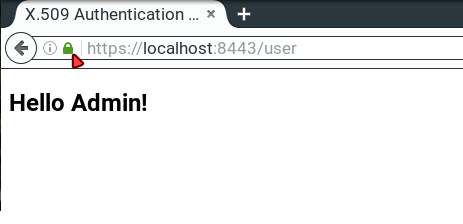
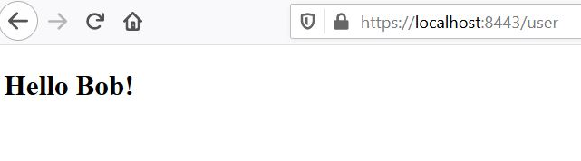

## X.509 Authentication in Spring Security

# 1. Visão Geral
Neste artigo, vamos nos concentrar nos principais casos de uso para autenticação de certificado X.509 - verificar a identidade de um ponto de comunicação ao usar o protocolo HTTPS (HTTP sobre SSL).

Simplificando - enquanto uma conexão segura é estabelecida, o cliente verifica o servidor de acordo com seu certificado (emitido por uma autoridade de certificação confiável).

Mas, além disso, o X.509 no Spring Security pode ser usado para verificar a identidade de um cliente pelo servidor durante a conexão. Isso é chamado de “autenticação mútua” e veremos como isso é feito aqui também.

Por fim, abordaremos quando faz sentido usar esse tipo de autenticação.

Para demonstrar a verificação do servidor, criaremos um aplicativo da web simples e instalaremos uma autoridade de certificação personalizada em um navegador.

Além disso, para autenticação mútua, criaremos um certificado de cliente e modificaremos nosso servidor para permitir apenas clientes verificados.

É altamente recomendável seguir o tutorial passo a passo e criar os certificados, bem como o keystore e o truststore, você mesmo, de acordo com as instruções apresentadas nas seções a seguir. 

# 2. CA raiz autoassinada
Para poder assinar nossos certificados do lado do servidor e do lado do cliente, primeiro precisamos criar nosso próprio certificado de CA raiz autoassinado. Dessa forma, atuaremos como nossa própria autoridade de certificação.

Para este propósito, usaremos a biblioteca openssl, portanto, precisamos instalá-la antes de seguir para a próxima etapa.

Vamos agora criar o certificado CA:

```
openssl req -x509 -sha256 -days 3650 -newkey rsa:4096 -keyout rootCA.key -out rootCA.crt
```

Quando executamos o comando acima, precisamos fornecer a senha para nossa chave privada. Para o propósito deste tutorial, usamos changeit como senha.

Além disso, precisamos inserir informações que formam o chamado nome distinto. Aqui, fornecemos apenas o CN (Nome comum) - isaccanedo.com - e deixamos as outras partes em branco.

# 3. Keystore
Requisito opcional: Para usar chaves criptograficamente fortes junto com recursos de criptografia e descriptografia, precisaremos dos “Arquivos de política de jurisdição de força ilimitada de extensão de criptografia Java (JCE)” instalados em nosso JVM.

Eles podem ser baixados, por exemplo, do Oracle (siga as instruções de instalação incluídas no download). Algumas distribuições Linux também fornecem um pacote instalável por meio de seus gerenciadores de pacotes.

Um keystore é um repositório que nosso aplicativo Spring Boot usará para manter a chave privada e o certificado do nosso servidor. Em outras palavras, nosso aplicativo usará o armazenamento de chaves para servir o certificado aos clientes durante o handshake SSL.

Neste tutorial, usamos o formato Java Key-Store (JKS) e uma ferramenta de linha de comando keytool.

### 3.1. Certificado do lado do servidor
Para implementar a autenticação X.509 do lado do servidor em nosso aplicativo Spring Boot, primeiro precisamos criar um certificado do lado do servidor.

Vamos começar criando uma chamada solicitação de assinatura de certificado (CSR):

```
openssl req -new -newkey rsa:4096 -keyout localhost.key –out localhost.csr
```

Da mesma forma, quanto ao certificado CA, temos que fornecer a senha para a chave privada. Além disso, vamos usar localhost como um nome comum (CN).

Antes de prosseguirmos, precisamos criar um arquivo de configuração - localhost.ext. Ele armazenará alguns parâmetros adicionais necessários durante a assinatura do certificado.

```
authorityKeyIdentifier=keyid,issuer
basicConstraints=CA:FALSE
subjectAltName = @alt_names
[alt_names]
DNS.1 = localhost
```

Um arquivo pronto para usar também está disponível aqui.

Agora, é hora de assinar a solicitação com nosso certificado rootCA.crt e sua chave privada:

```
openssl x509 -req -CA rootCA.crt -CAkey rootCA.key -in localhost.csr -out localhost.crt -days 365 -CAcreateserial -extfile localhost.ext
```

Observe que temos que fornecer a mesma senha que usamos quando criamos nosso certificado CA.

Neste estágio, finalmente temos um certificado localhost.crt pronto para usar, assinado por nossa própria autoridade de certificação.

Para imprimir os detalhes do nosso certificado em um formato legível, podemos usar o seguinte comando:

```
openssl x509 -in localhost.crt -text
```

### 3.2. Importar para o Keystore
Nesta seção, veremos como importar o certificado assinado e a chave privada correspondente para o arquivo keystore.jks.

Usaremos o arquivo PKCS 12 para empacotar a chave privada do nosso servidor junto com o certificado assinado. Em seguida, vamos importá-lo para o keystore.jks recém-criado.

Podemos usar o seguinte comando para criar um arquivo .p12:

```
openssl pkcs12 -export -out localhost.p12 -name "localhost" -inkey localhost.key -in localhost.crt
```

Portanto, agora temos o localhost.key e o localhost.crt agrupados no único arquivo localhost.p12.

Agora vamos usar o keytool para criar um repositório keystore.jks e importar o arquivo localhost.p12 com um único comando:

```
keytool -importkeystore -srckeystore localhost.p12 -srcstoretype PKCS12 -destkeystore keystore.jks -deststoretype JKS
```

Neste estágio, temos tudo pronto para a parte de autenticação do servidor. Vamos continuar com a configuração do nosso aplicativo Spring Boot.

# 4. Exemplo de aplicativo
Nosso projeto de servidor protegido por SSL consiste em uma classe de aplicativo anotada com @SpringBootApplication (que é um tipo de @Configuration), um arquivo de configuração application.properties e um front-end muito simples no estilo MVC.

Tudo o que o aplicativo precisa fazer é apresentar uma página HTML com um “Olá, {usuário}!” mensagem. Dessa forma, podemos inspecionar o certificado do servidor em um navegador para ter certeza de que a conexão está verificada e protegida.

### 4.1. Dependências Maven
Primeiro, criamos um novo projeto Maven com três pacotes Spring Boot Starter incluídos:

```
<dependency>
    <groupId>org.springframework.boot</groupId>
    <artifactId>spring-boot-starter-security</artifactId>
</dependency>
<dependency>
    <groupId>org.springframework.boot</groupId>
    <artifactId>spring-boot-starter-web</artifactId>
</dependency>
<dependency>
    <groupId>org.springframework.boot</groupId>
    <artifactId>spring-boot-starter-thymeleaf</artifactId>
</dependency>
```

Para referência: podemos encontrar os pacotes no Maven Central (segurança, web, thymeleaf).
https://search.maven.org/classic/#search%7Cgav%7C1%7Cg%3A%22org.springframework.boot%22%20AND%20a%3A%22spring-boot-starter-thymeleaf%22

### 4.2. Aplicativo Spring Boot
Na próxima etapa, criamos a classe de aplicativo principal e o controlador de usuário:

```
@SpringBootApplication
public class X509AuthenticationServer {
    public static void main(String[] args) {
        SpringApplication.run(X509AuthenticationServer.class, args);
    }
}

@Controller
public class UserController {
    @RequestMapping(value = "/user")
    public String user(Model model, Principal principal) {
        
        UserDetails currentUser 
          = (UserDetails) ((Authentication) principal).getPrincipal();
        model.addAttribute("username", currentUser.getUsername());
        return "user";
    }
}
```

Agora, dizemos ao aplicativo onde encontrar nosso keystore.jks e como acessá-lo. Definimos SSL para um status “habilitado” e alteramos a porta de escuta padrão para indicar uma conexão segura.

Além disso, configuramos alguns detalhes do usuário para acessar nosso servidor por meio da autenticação básica:

```
server.ssl.key-store=../store/keystore.jks
server.ssl.key-store-password=${PASSWORD}
server.ssl.key-alias=localhost
server.ssl.key-password=${PASSWORD}
server.ssl.enabled=true
server.port=8443
spring.security.user.name=Admin
spring.security.user.password=admin
```

Este será o modelo HTML, localizado na pasta resources/templates:

```
<!DOCTYPE html>
<html xmlns:th="http://www.thymeleaf.org">
<head>
    <title>X.509 Authentication Demo</title>
</head>
<body>
    <h2>Hello <span th:text="${username}"/>!</h2>
</body>
</html>
```

### 4.3. Instalação de CA raiz
Antes de terminarmos esta seção e olharmos o site, precisamos instalar nossa autoridade de certificação raiz gerada como um certificado confiável em um navegador.

Uma instalação exemplar de nossa autoridade de certificação para o Mozilla Firefox teria a seguinte aparência:

- Digite sobre: preferências na barra de endereço;
- Abra Avançado -> Certificados -> Ver Certificados -> Autoridades;
- Clique em Importar;
- Localize a pasta isaccanedo tutoriais e sua subpasta spring-security-x509 / keystore;
- Selecione o arquivo rootCA.crt e clique em OK
- Escolha “Confiar nesta CA para identificar sites” e clique em OK

Observação: se você não quiser adicionar nossa autoridade de certificação à lista de autoridades confiáveis, mais tarde terá a opção de abrir uma exceção e mostrar o site robusto, mesmo quando mencionado como inseguro. Mas então você verá um símbolo de "ponto de exclamação amarelo" na barra de endereço, indicando a conexão insegura!

Em seguida, navegaremos até o módulo spring-security-x509-basic-auth e executaremos:

```
mvn spring-boot:run
```

Por fim, acessamos https: // localhost: 8443 / user, insira nossas credenciais de usuário em application.properties e deverá ver a mensagem “Hello Admin!” mensagem. Agora podemos inspecionar o status da conexão clicando no símbolo de “cadeado verde” na barra de endereço, e deve ser uma conexão segura.



# 5. Autenticação mútua

Na seção anterior, apresentamos como implementar o esquema de autenticação SSL mais comum - autenticação do lado do servidor. Isso significa que apenas um servidor se autenticava para os clientes.

Nesta seção, descreveremos como adicionar a outra parte da autenticação - autenticação do lado do cliente. Desta forma, apenas clientes com certificados válidos assinados pela autoridade em que nosso servidor confia, podem acessar nosso site seguro.

Mas antes de continuar, vamos ver quais são os prós e os contras de usar a autenticação SSL mútua.

Prós:

- A chave privada de um certificado de cliente X.509 é mais forte do que qualquer senha definida pelo usuário. Mas tem que ser mantido em segredo !;
- Com um certificado, a identidade de um cliente é conhecida e fácil de verificar;
- Não há mais senhas esquecidas!

Contras:

- Precisamos criar um certificado para cada novo cliente;
- O certificado do cliente deve ser instalado em um aplicativo cliente. Na verdade: a autenticação do cliente X.509 depende do dispositivo, o que torna impossível usar esse tipo de autenticação em áreas públicas, por exemplo, em um cibercafé;
- Deve haver um mecanismo para revogar certificados de cliente comprometidos;
- Devemos manter os certificados dos clientes. Isso pode facilmente se tornar caro.

### 5.1. Truststore
Um trustore de alguma forma é o oposto de um keystore. Ele contém os certificados das entidades externas em que confiamos.

Em nosso caso, é suficiente manter o certificado de CA raiz no armazenamento confiável.

Vamos ver como criar um arquivo truststore.jks e importar rootCA.crt usando keytool:

```
keytool -import -trustcacerts -noprompt -alias ca -ext san=dns:localhost,ip:127.0.0.1 -file rootCA.crt -keystore truststore.jks
```

Observe que precisamos fornecer a senha para o truststore.jks recém-criado. Aqui, usamos novamente a frase secreta para alterar.

É isso, importamos nosso próprio certificado CA e o truststore está pronto para ser usado.

### 5.2. Configuração de segurança Spring
Para continuar, estamos modificando nosso X509AuthenticationServer para estender a partir de WebSecurityConfigurerAdapter e substituir um dos métodos de configuração fornecidos. Aqui, configuramos o mecanismo x.509 para analisar o campo Nome Comum (CN) de um certificado para extrair nomes de usuário.

Com esses nomes de usuário extraídos, Spring Security está procurando em um UserDetailsService fornecido para os usuários correspondentes. Portanto, também implementamos essa interface de serviço contendo um usuário de demonstração.

```
Dica: Em ambientes de produção, este UserDetailsService pode carregar seus usuários, por exemplo, de uma fonte de dados JDBC.
```

Você deve notar que anotamos nossa classe com @EnableWebSecurity e @EnableGlobalMethodSecurity com pré/pós-autorização habilitada.

Com o último, podemos anotar nossos recursos com @PreAuthorize e @PostAuthorize para controle de acesso refinado:

```
@SpringBootApplication
@EnableWebSecurity
@EnableGlobalMethodSecurity(prePostEnabled = true)
public class X509AuthenticationServer extends WebSecurityConfigurerAdapter {
    ...

    @Override
    protected void configure(HttpSecurity http) throws Exception {
        http.authorizeRequests().anyRequest().authenticated()
          .and()
          .x509()
            .subjectPrincipalRegex("CN=(.*?)(?:,|$)")
            .userDetailsService(userDetailsService());
    }

    @Bean
    public UserDetailsService userDetailsService() {
        return new UserDetailsService() {
            @Override
            public UserDetails loadUserByUsername(String username) {
                if (username.equals("Bob")) {
                    return new User(username, "", 
                      AuthorityUtils
                        .commaSeparatedStringToAuthorityList("ROLE_USER"));
                }
                throw new UsernameNotFoundException("User not found!");
            }
        };
    }
}
```

Como dito anteriormente, agora podemos usar o controle de acesso baseado em expressão em nosso controlador. Mais especificamente, nossas anotações de autorização são respeitadas por causa da anotação @EnableGlobalMethodSecurity em nossa @Configuration:

```
@Controller
public class UserController {
    @PreAuthorize("hasAuthority('ROLE_USER')")
    @RequestMapping(value = "/user")
    public String user(Model model, Principal principal) {
        ...
    }
}
```

Uma visão geral de todas as opções de autorização possíveis pode ser encontrada na documentação oficial.

Como uma etapa de modificação final, temos que informar ao aplicativo onde nosso armazenamento confiável está localizado e que a autenticação do cliente SSL é necessária (server.ssl.client-auth = need).

Portanto, colocamos o seguinte em nosso application.properties:

```
server.ssl.trust-store=store/truststore.jks
server.ssl.trust-store-password=${PASSWORD}
server.ssl.client-auth=need
```

Agora, se executarmos o aplicativo e apontarmos nosso navegador para https://localhost:8443/user, seremos informados de que o par não pode ser verificado e ele nega a abertura de nosso site.

### 5.3. Certificado do lado do cliente
Agora é hora de criar o certificado do lado do cliente. As etapas que precisamos seguir são praticamente as mesmas do certificado do lado do servidor que já criamos.

Primeiro, temos que criar uma solicitação de assinatura de certificado:

```
openssl req -new -newkey rsa:4096 -nodes -keyout clientBob.key -out clientBob.csr
```

Teremos que fornecer informações que serão incorporadas ao certificado. Para este exercício, vamos inserir apenas o nome comum (CN) - Bob. É importante, pois usamos essa entrada durante a autorização e apenas Bob é reconhecido por nosso aplicativo de amostra.

Em seguida, precisamos assinar a solicitação com nosso CA:

```
openssl x509 -req -CA rootCA.crt -CAkey rootCA.key -in clientBob.csr -out clientBob.crt -days 365 -CAcreateserial
```

A última etapa que precisamos realizar é empacotar o certificado assinado e a chave privada no arquivo PKCS:

```
openssl pkcs12 -export -out clientBob.p12 -name "clientBob" -inkey clientBob.key -in clientBob.crt
```

Finalmente, estamos prontos para instalar o certificado do cliente no navegador.

Novamente, usaremos o Firefox:

-Digite sobre: preferências na barra de endereços;
- Abra Avançado -> Ver Certificados -> Seus Certificados;
- Clique em Importar;
- Localize a pasta de tutoriais do isaccanedo e sua subpasta spring-security-x509/store;
- Selecione o arquivo clientBob.p12 e clique em OK;
- Insira a senha do seu certificado e clique em OK.

Agora, quando atualizarmos nosso site, seremos solicitados a selecionar o certificado de cliente que gostaríamos de usar:


Se virmos uma mensagem de boas-vindas como “Olá, Bob!”, Isso significa que tudo funciona como esperado!



# 6. Autenticação mútua com XML
Adicionar autenticação de cliente X.509 a uma configuração de segurança http em XML também é possível:

```
<http>
    ...
    <x509 subject-principal-regex="CN=(.*?)(?:,|$)" 
      user-service-ref="userService"/>

    <authentication-manager>
        <authentication-provider>
            <user-service id="userService">
                <user name="Bob" password="" authorities="ROLE_USER"/>
            </user-service>
        </authentication-provider>
    </authentication-manager>
    ...
</http>
```

Para configurar um Tomcat subjacente, temos que colocar nosso keystore e nosso truststore em sua pasta conf e editar o server.xml:

```
<Connector port="8443" protocol="HTTP/1.1" SSLEnabled="true" scheme="https" secure="true"
    clientAuth="true" sslProtocol="TLS"
    keystoreFile="${catalina.home}/conf/keystore.jks"
    keystoreType="JKS" keystorePass="changeit"
    truststoreFile="${catalina.home}/conf/truststore.jks"
    truststoreType="JKS" truststorePass="changeit"
/>
```

```
Dica: Com clientAuth definido como “want”, o SSL ainda está ativado, mesmo se o cliente não fornecer um certificado válido. Mas, neste caso, temos que usar um segundo mecanismo de autenticação, por exemplo, um formulário de login, para acessar os recursos protegidos.
```

# 7. Conclusão
Em resumo, aprendemos como criar um certificado CA autoassinado e como usá-lo para assinar outros certificados.

Além disso, criamos certificados do lado do servidor e do lado do cliente. Em seguida, apresentamos como importá-los para um keystore e um truststore de acordo.

Além disso, agora você deve ser capaz de empacotar um certificado junto com sua chave privada no formato PKCS12.

Também discutimos quando faz sentido usar a autenticação de cliente Spring Security X.509, portanto, cabe a você decidir se deve implementá-la em seu aplicativo da web ou não.


